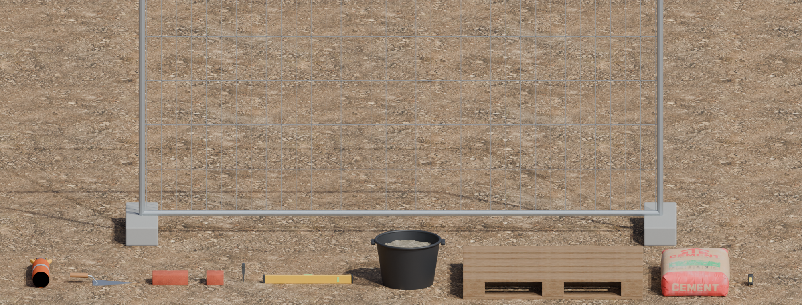

# Asset register — slice 1

All models are in metres at real-world scale, self-contained `.gltf` (buffers and textures embedded; loads in three.js and Godot), in `assets/models/`. Unless noted, the origin is at the bottom centre.
Rebuild everything with `blender/make_assets.py`. It also writes `docs/asset_report.json` and the check image `docs/asset_lineup.png`.

## Models

| File | What | Source | Tris | Size | Notes |
|---|---|---|---|---|---|
| `brick_nf.gltf` | NF brick 240 × 115 × 71 mm | Blender (script) | 108 | 145 KB | 3 mm bevel, procedural clay texture with burn specks |
| `brick_half.gltf` | Half brick 115 × 115 × 71 mm | Blender (script) | 108 | 145 KB | closes alternate courses (stretcher bond) |
| `trowel.gltf` | Brick trowel, 280 mm pointed blade | Blender (script) | 156 | 13 KB | **origin = handle grip** |
| `fp_arms.gltf` | First-person forearms `ArmL`, `ArmR` | Blender (script) | 1168 | 62 KB | **origin = elbow**, hand points +Y (forward in game). Hi-vis sleeve with reflective band, coated work gloves |
| `mortar_tub.gltf` | Black PE mortar tub, half full | Blender (script) | 2732 | 1107 KB | mortar surface uses Poly Haven concrete texture |
| `pallet_euro.gltf` | EPAL pallet 1200 × 800 × 144 mm | Blender (script) | 2160 | 1347 KB | real board and block layout; plywood texture |
| `line_pin.gltf` | Steel line pin | Blender (script) | 76 | 6 KB | **origin = tip**; the string itself is drawn in the game |
| `spirit_level.gltf` | 600 mm spirit level | Blender (script) | 348 | 36 KB | |
| `bauzaun.gltf` | Mobile site fence panel 3.5 × 2.0 m on feet | Blender (script) | 896 | 82 KB | wire mesh is real geometry, no alpha tricks |
| `cement_bag.gltf` | Cement bag | [Poly Haven](https://polyhaven.com/a/cement_bag), CC0 | 844 | 1884 KB | re-origined in Blender |
| `measuring_tape_01.gltf` | Tape measure | [Poly Haven](https://polyhaven.com/a/measuring_tape_01), CC0 | 2868 | 582 KB | set dressing |

## Textures and lighting (used directly by the game)

| File | Use | Source |
|---|---|---|
| `textures/brown_mud_dry_*.jpg` | site ground | [Poly Haven](https://polyhaven.com/a/brown_mud_dry), CC0 |
| `textures/concrete_floor_02_*.jpg` | concrete footing, mortar | [Poly Haven](https://polyhaven.com/a/concrete_floor_02), CC0 |
| `textures/plywood_diffuse.jpg` | pallet boards | [Poly Haven](https://polyhaven.com/a/plywood), CC0 |
| `hdri/kloofendal_48d_partly_cloudy_puresky_1k.jpg` | sky and ambient light (tone-mapped from the `.hdr` by the Blender script) | [Poly Haven](https://polyhaven.com/a/kloofendal_48d_partly_cloudy_puresky), CC0 |

Re-download with `tools/fetch_polyhaven.py`. CC0 means no attribution is required; we credit Poly Haven anyway.

## Not needed for slice 1

Wheelbarrow, cement mixer, scaffold, house parts, hens. These come with later slices.
